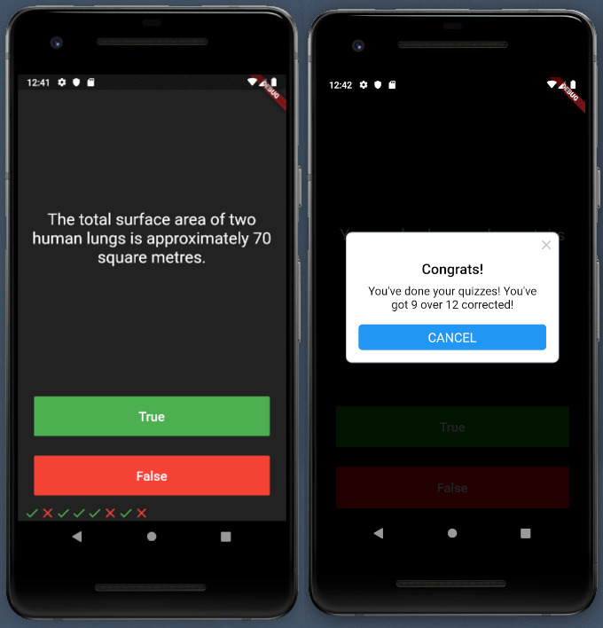

**Quizzler** is a simple app for displaying quizzes. This is an exercise for my Flutter couse on AppBrewery

## What I learnt

- Modularising your code into separate classes.
- Dart classes and objects.
- Using class constructors.
- Extracting Widgets to refactor your code.
- private and public modifiers in Dart.
- How to use Dart lists.
- The difference between var, const and final.
